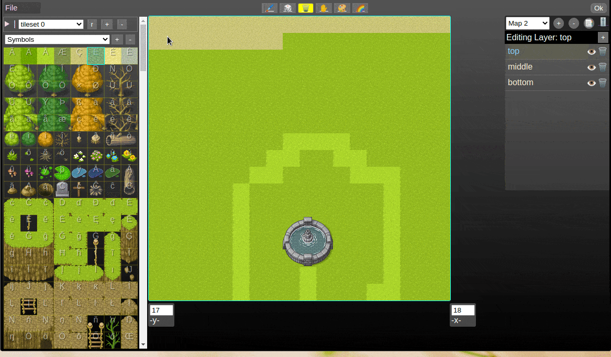
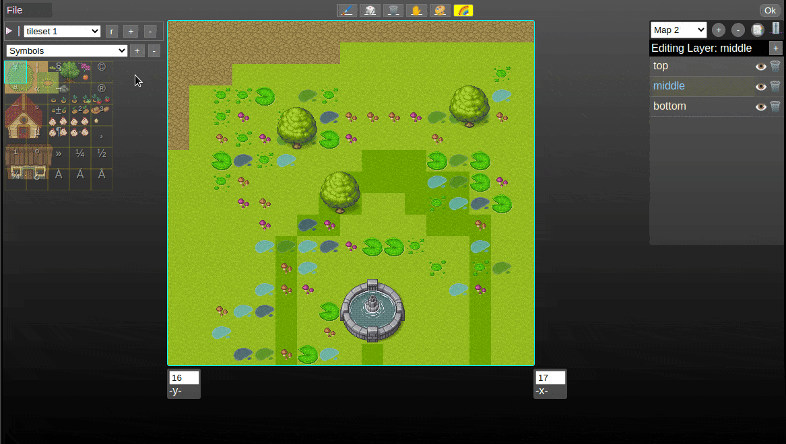
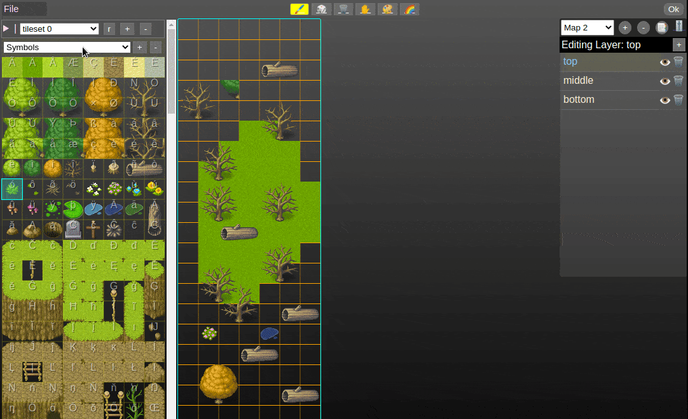

<h1 align="center">TilemapEditor</h1>

try it online at https://blurymind.github.io/tilemap-editor/

---

<h3 align="center">
  <a href="#information_source-about">About</a>&nbsp;|
  <a href="#information_source-features">Features</a>&nbsp;|
  <a href="#interrobang-reason">Reason</a>&nbsp;|
  <a href="#link-getting-started">Getting started</a>&nbsp;|
  <a href="#link-api">Api use</a>&nbsp;|
  <a href="#link-how-to-contribute">How to Contribute</a>&nbsp;|
</h3>

---

## :space_invader: About

TileMap Editor is a fat-free tile map editor with zero dependencies and a scalable, mobile-friendly interface.

## :gift: features

- Multiple tileset support
- Multiple tilemap support
- Multi-tile selection and painting (drag select multiple tiles from the tileset)
- Tileset meta-data editing (Assign tags to tiles, automatic assignment of symbols to tiles)
- Animated tiles support
- Tilemap layers (as many as you like)
- Export boilerplate code for kaboomjs https://kaboomjs.com/ (wip)
- Customizable export data
- Resizable tilemap - non destructive too
- Paint tool, Pan tool, eraser tool, Bucket fill tool, Random tile tool, Pick tile tool
- Responsive interface (scales down to portrait mode on mobile)
- Tiny footprint 
- Easy I/O api that lets you transform and save data with ease

Planned:
- Export data feature
- Undo/redo system
- Paint tool modes (line, square, circle,etc)
- tiled i/o

<p align="center">
  
</p>

Multiple tilemaps and tilesets are supported in one file/session
<p align="center">
  
</p>

It also scales all the way down to a smartphone screen in portrait mode
 <p align="center">
  
</p>

It can even do animated tiles
 <p align="center">
  
</p>

## :cyclone: Reason

But Todor, why are you making another tilemap editor with all these other ones out there?

While I am a big fan of Tiled and LdTk, for my case I was looking for something that neither had:
- Tiny footprint. Other tilemap editors are 60-100+ mb and require installation. Tilemap-editor is 30kb as of the time of writing this.
- Can be used by other js projects/web apps/websites. It has been designed to be a module, which you can plug in your project easily.
- No build process required, no webpack, no transpiling. Thats true, it's a single js+css file with no external dependencies!
- Runs everywhere - mobile too. The other available options can not run on android or ios.
- Responsive interface that scales all the way down to a portrait mode smartphone. Thats right, one of the goals is to let you make maps on your phone.
- Again it just uses vanilla javascript, no react, no webpack, no 1gb+ eaten by the node modules folder. Inspect its code in the browser and it all there clear as a day.
- No complicated build processes. Since it's just a js file, you don't need to wait for it to rebuild every time you change it

## :eyeglasses: Getting started

   ```bash
   $ git clone https://github.com/blurymind/tilemap-editor.git
   $ yarn
   $ yarn start
   ```

## :book: Api

To get it from npm, you can run

```bash
$ npm i tilemap-editor
or
$ yarn add tilemap-editor
```
  
To use it, you can import it via require or in the index file like so

   ```js
   // include the js and css files
<link rel="stylesheet" href="styles.css"/>
<script src="tilemap-editor.js"></script>

<script>
TilemapEditor.init("tileMapEditor",{ // The id of the element that will become the tilemap-editor (must exist in your dom)
    // loads tilemap data which was saved before. undefined will start you with an empty map.
    // Takes a parsed json object with a data struct that tiled-editor can read (an object with maps and tileSets):
    // { maps : {...}, tileSets: {...}}
    tileMapData: ioJsonData,
    // tileSize is used to slice the tileset and give the tilemap the right sized grid
    tileSize: 32,
    // How many tiles is the initial map wide
    mapWidth: 20,
    // How many tiles is the initial map tall
    mapHeight: 20,
    // tileset images src (required)
    tileSetImages: ["https://i.imgur.com/ztwPZOI.png", "./free.png"],
    // You can write your own custom load image function here and use it for the tileset src. If you dont, the base64 string will be used instead
    tileSetLoaders: {
        fromUrl: {
            name: "Any url", // name is required and used for the loader's title in the select menu
            prompt: (setSrc) => { // Pass prompt ot onSelectImage. Prompt lets you do anything without asking the user to select a file
                const fileUrl = window.prompt("What is the url of the tileset?", "https://i.imgur.com/ztwPZOI.png");
                if(fileUrl !== null) setSrc(fileUrl)
            }
        },
        imgur: {
            name: "Imgur (host)",
            onSelectImage: (setSrc, file, base64) => { // In case you want them to give you a file from the fs, you can do this instead of prompt
                uploadImageToImgur(file).then(result=>{
                    console.log(file, base64);
                    console.log("Uploaded to imgur", result);
                    setSrc(result.data.link);
                });
            },
        },
    },
    // You can write your own tilemap exporters here. Whatever they return will get added to the export data you get out when you trigger onAppy
    tileMapExporters: {
        kaboomJs: { // the exporter's key is later used by the onApply option
            name: "Download KaboomJs boilerplate code", // name of menu entry
            description: "Exports boilerplate js code for KaboomJs",
            transformer: ({flattenedData, maps, tileSets, activeMap, downloadAsTextFile})=> {
                const text = kaboomJsExport({flattenedData, maps, tileSets, activeMap});
                downloadAsTextFile(text, "KaboomJsMapData.js");// you can use this util method to get your text as a file
            }
        },
    },
    tileMapImporters: {
        //similar to the exporters, you can write your own data importer, which will then be added to the file menu
        tiledImport: {
            name: "Import Tiled json file (TODO)", // name of menu entry
            onSelectFiles: (setData, files) => { // callback that is triggered when file(s) are selected.
                const readFile = new FileReader();
                readFile.onload = (e) => {
                    const json = JSON.parse(e.target.result);
                    // At this point we got the json data from the tiled file. We need to convert it into
                    // a data struct that tiled-editor can read (an object with maps and tileSets):
                    // { maps : {...}, tileSets: {...}}
                    alert("Not implemented yet... pr welcome ;)");
                    return;// TODO tiled json file parser

                    setData(json); // Finally pass that to the setData function, which will load it into tiled-editor
                };
                readFile.readAsText(files[0]);
            },
            acceptFile: "application/JSON" // You can control what files are accepted
        }
    },
    // If passed, a new button gets added to the header, upon being clicked, you can get data from the tilemap editor and trigger events
    onApply: {
        onClick: ({flattenedData, maps, tileSets, activeMap}) => {
            console.log("onClick, gets the data too")
            const copyText = document.createElement("input");
            document.body.appendChild(copyText);
            copyText.value = kaboomJsExport({flattenedData, maps, tileSets, activeMap});
            copyText.select();
            copyText.setSelectionRange(0, 99999); /* For mobile devices */
            document.execCommand("copy");

            /* Alert the copied text */
            alert("Copied the text: " + copyText.value);
            // const kbCode = kaboomJsExport({flattenedData, maps, tileSets, activeMap});
        },
        buttonText: "Copy Kb to clip", // controls the apply button's text
    },
})
</script>
   ```
   

## :wrench: How to Contribute

You are welcome to add new features or fix some bugs:

1. Fork this repository

2. Clone your fork
   ```bash
   $ git clone https://github.com/blurymind/tilemap-editor.git
   ```

- Create a branch with your changes

  ```bash
  $ git checkout -b my-awesome-changes
  ```

- Make the commit with your changes

  ```bash
  $ git commit -m 'feat: add a shortcut to copy a tile of the canvas'
  ```

- Push your branch

  ```bash
  # Send the code to your remote branch
  $ git push origin my-awesome-changes
  ```

- Create a _Pull Request_
