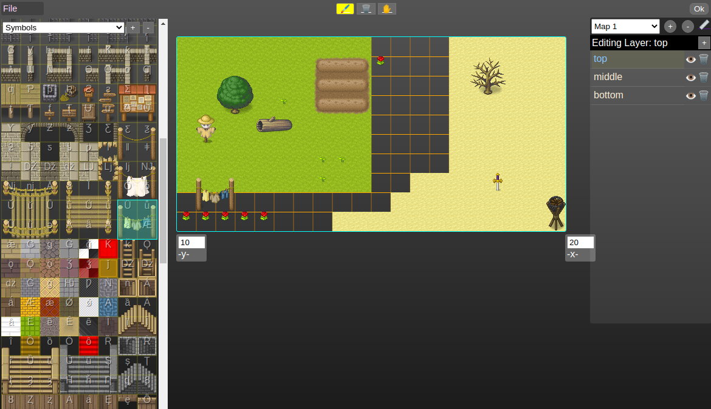
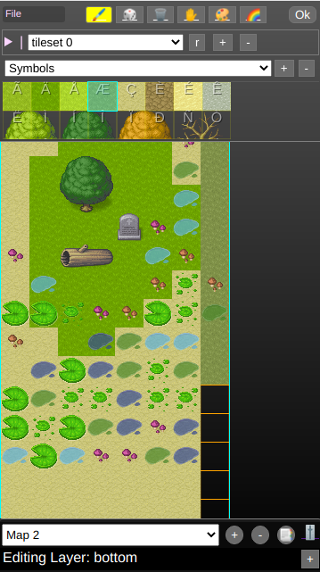

<h1 align="center">TilemapEditor</h1>

---

<h3 align="center">
  <a href="#information_source-about">About</a>&nbsp;|
  <a href="#features">Features</a>&nbsp;|
  <a href="#interrobang-reason">Reason</a>&nbsp;|
  <a href="#getting-started">Reason</a>&nbsp;|
  <a href="#link-how-to-contribute">How to Contribute</a>&nbsp;|
</h3>

---

## :information_source: About

TileMap Editor is a fat-free tile map editor with zero dependencies and a scalable, mobile-friendly interface.

## :information_source: features


<p align="center">
  
</p>

 <p align="center">
  
</p>

## :interrobang: Reason

But Todor, why are you making another tilemap editor with all these other ones out there?

While I am a big fan of Tiled and LdTk, for my case I was looking for something that neither had:
- Tiny footprint. Other tilemap editors are 60-100+ mb and require installation. Tilemap-editor is 30kb as of the time of writing this.
- Can be used by other js projects/web apps/websites. It has been designed to be a module, which you can plug in your project easily.
- No build process required, no webpack, no transpiling. Thats true, it's a single js+css file with no external dependencies!
- Runs everywhere - mobile too. The other available options can not run on android or ios.
- Responsive interface that scales all the way down to a portrait mode smartphone. Thats right, one of the goals is to let you make maps on your phone.
- Again it just uses vanilla javascript, no react, no webpack, no 1gb+ eaten by the node modules folder. Inspect its code in the browser and it all there clear as a day.
- No complicated build processes. Since it's just a js file, you don't need to wait for it to rebuild every time you change it

## :link: Getting started

   ```bash
   $ git clone https://github.com/blurymind/tilemap-editor.git
   $ yarn
   $ yarn start
   ```

## :link: How to Contribute

You are welcome to add new features or fix some bugs:

1. Fork this repository

2. Clone your fork
   ```bash
   $ git clone https://github.com/blurymind/tilemap-editor.git
   ```

- Create a branch with your changes

  ```bash
  $ git checkout -b my-awesome-changes
  ```

- Make the commit with your changes

  ```bash
  $ git commit -m 'feat: add a shortcut to copy a tile of the canvas'
  ```

- Push your branch

  ```bash
  # Send the code to your remote branch
  $ git push origin my-awesome-changes
  ```

- Create a _Pull Request_
